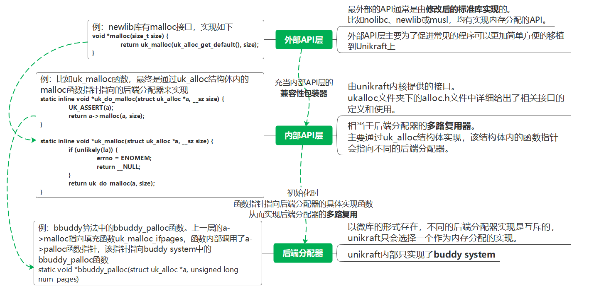

# Unikraft内存相关源码阅读

Unikraft的四大模块中选择了内存模块进行源码的阅读。

接下来我将以下面的顺序对该模块进行讲解。
1. 内存系统的分层结构——初始化以及使用
2. 内存系统的外部API层——兼容性包装器
3. 内存系统的内部API层——多路复用器
4. 内存系统的后端分配器实现——buddy系统

# 内存系统的分层结构——初始化以及使用

## 结构部分（内存系统的使用）

Unikraft设计的核心思路是系统原语的完全模块化以及提供一套高性能可组合的API，所以结构上使用了分层构建的方法，unikraft的内存系统同样也是分层进行构建的。

unikraft的内存系统可以分为三层，第一层是外部API层，第二层是内部API层，第三层是后端分配器层。这三层的结构图大致如下。


最外部的API通常是由修改后的标准库实现的。比如nolibc、newlib或musl，均有实现内存分配的API。该层会对内部提供的API进行兼容性包装。

然后是内部API层，是由unikraft内核提供的接口。该层相当于后端分配器的多路复用器。在ukalloc文件夹下的alloc.h文件中，详细给出了相关接口的定义和使用，复用器 的功能主要通过uk_alloc结构体实现，该结构体内的函数指针会指向不同的后端分配器。

最后是后端分配器层。以微库的形式存在，不同的后端分配器实现是互斥的，unikraft只会选择一个作为内存分配的实现。内部API层在经过初始化之后，结构体内的函数指针会指向具体的某一个后端分配器。

该图的左半部分就是一个经典的例子。首先是外部API层的newlib库的malloc函数的具体实现就是直接调用内部API层的uk_malloc函数。然后内部API层的uk_malloc函数会通过uk_alloc结构体的函数指针malloc函数来实现，在这个例子中，a->malloc函数内部实现中调用了a->palloc函数指针指向的函数，而a->palloc函数指针则最终指向了后端分配器buddy system的bbuddy_palloc函数来实现。

以上是内存系统使用的大致过程。

## 内存系统的初始化

然后是初始化部分。在系统启动过程中，会对内存进行初始化，在初始化中会实现根据系统配置文件选择一个后端分配器，然后给选中的后端分配器传递堆的起始位置以及可用的长度两个参数，以进行后端分配器的初始化。再将该分配器设置为系统的内存分配器。
源码如下所示。
```c++
void ukplat_entry(int argc, char *argv[]) {
    ......
	a = heap_init();
	if (unlikely(!a))
		UK_CRASH("Failed to initialize memory allocator\n");
	else {
		rc = ukplat_memallocator_set(a);
		if (unlikely(rc != 0))
			UK_CRASH("Could not set the platform memory allocator\n");
	}
    ......
}

static struct uk_alloc *heap_init() {
    ......
    if (!a)
        a = uk_alloc_init((void *)md->vbase, md->len);
    else
        uk_alloc_addmem(a, (void *)md->vbase, md->len);
    ......
}

#if CONFIG_LIBUKBOOT_INITBBUDDY
#include <uk/allocbbuddy.h>
#define uk_alloc_init uk_allocbbuddy_init
#elif CONFIG_LIBUKBOOT_INITREGION
#include <uk/allocregion.h>
#define uk_alloc_init uk_allocregion_init
#elif CONFIG_LIBUKBOOT_INITMIMALLOC
#include <uk/mimalloc.h>
#define uk_alloc_init uk_mimalloc_init
#elif CONFIG_LIBUKBOOT_INITTLSF
#include <uk/tlsf.h>
#define uk_alloc_init uk_tlsf_init
#elif CONFIG_LIBUKBOOT_INITTINYALLOC
#include <uk/tinyalloc.h>
#define uk_alloc_init uk_tinyalloc_init
#endif
```
在ukplat_entry函数中，会调用heap_init函数，该函数会实现内存的初始化以及选定内存分配器，函数的返回结果就是uk_alloc。初始化完成之后，再使用ukplat_memallocator_set函数，将返回的uk_alloc设置为内存分配器。

再看到heap_init函数的实现中，其关键代码主要是判断a是否为空，如果为空，则通过uk_alloc_init函数创建一个分配器，如果不为空，则调用uk_alloc_addmem函数，将新的分配器添加到链表a中。

其中uk_alloc_init函数是一个宏定义，会被替换成五种后端分配器的其中一个，这会在boot.c文件的开始部分根据配置文件的宏定义进行选择，unikraft中默认使用第一个，即uk_allocbbuddy_init函数。

## 整体结构

整体结构如下。


# 内存系统规定外部API层——兼容性包装器

最外部的API通常是由修改后的标准库实现的。比如nolibc、newlib或musl，均有实现内存分配的API。该层会对内部提供的API进行**兼容性包装**，从而可以实现对各种程序在Unikraft上进行简单快捷的移植。

比如newlib库中的mem.c文件，便定义了malloc函数这个接口，用于给上层的程序调用，该函数的实现如下。
```c++
void *malloc(size_t size) {
    return uk_malloc(uk_alloc_get_default(), size);
}
```
函数内部实现非常简单，直接调用了内部API层的uk_malloc函数作为返回结果。所以可以视为内部API层的一个兼容性包装器。


# 内存系统的内部API层——多路复用器

然后是内部API层，是由unikraft内核提供的接口。该层相当于后端分配器的多路复用器。在ukalloc文件夹下的alloc.h文件中，详细给出了相关接口的定义和使用，复用器 的功能主要通过uk_alloc结构体实现，该结构体内的函数指针会指向不同的后端分配器。

uk_alloc结构体的定义如下。
```c++
struct uk_alloc {
	/* memory allocation */
	uk_alloc_malloc_func_t malloc;
	uk_alloc_calloc_func_t calloc;
	uk_alloc_realloc_func_t realloc;
	uk_alloc_posix_memalign_func_t posix_memalign;
	uk_alloc_memalign_func_t memalign;
	uk_alloc_free_func_t free;

#if CONFIG_LIBUKALLOC_IFMALLOC
	uk_alloc_free_func_t free_backend;
	uk_alloc_malloc_func_t malloc_backend;
#endif

	/* page allocation interface */
	uk_alloc_palloc_func_t palloc;
	uk_alloc_pfree_func_t pfree;
	/* optional interfaces, but recommended */
	uk_alloc_getsize_func_t maxalloc; /* biggest alloc req. (bytes) */
	uk_alloc_getsize_func_t availmem; /* total memory available (bytes) */
	uk_alloc_getpsize_func_t pmaxalloc; /* biggest alloc req. (pages) */
	uk_alloc_getpsize_func_t pavailmem; /* total pages available */
	/* optional interface */
	uk_alloc_addmem_func_t addmem;

#if CONFIG_LIBUKALLOC_IFSTATS
	struct uk_alloc_stats _stats;
#endif

	/* internal */
	struct uk_alloc *next;
	__u8 priv[];
};
```
成员基本上都是函数指针类型，这些函数指针经过简单的包装之后，便会作为内部API层的接口给上层的外部API层使用。如下代码所示，给出了uk_malloc函数接口的实现。
```c++
static inline void *uk_do_malloc(struct uk_alloc *a, __sz size) {
	UK_ASSERT(a);
	return a->malloc(a, size);
}

static inline void *uk_malloc(struct uk_alloc *a, __sz size) {
	if (unlikely(!a)) {
		errno = ENOMEM;
		return __NULL;
	}
	return uk_do_malloc(a, size);
}
```
uk_malloc函数最终是通过a->malloc函数实现的。

这些函数指针相当于一个多路复用器，经过初始化之后，最终会指向后端分配器给出的具体实现函数，如下代码所示，在给结构体的函数指针进行初始化。
```c++
#define uk_alloc_init_palloc(a, palloc_func, pfree_func, pmaxalloc_func, \
			     pavailmem_func, addmem_func)		\
	do {								\
		(a)->malloc         = uk_malloc_ifpages;		\
		(a)->calloc         = uk_calloc_compat;			\
		(a)->realloc        = uk_realloc_ifpages;		\
		(a)->posix_memalign = uk_posix_memalign_ifpages;	\
		(a)->memalign       = uk_memalign_compat;		\
		(a)->free           = uk_free_ifpages;			\
		(a)->palloc         = (palloc_func);			\
		(a)->pfree          = (pfree_func);			\
		(a)->pavailmem      = (pavailmem_func);			\
		(a)->availmem       = (pavailmem_func != NULL)		\
				      ? uk_alloc_availmem_ifpages : NULL; \
		(a)->pmaxalloc      = (pmaxalloc_func);			\
		(a)->maxalloc       = (pmaxalloc_func != NULL)		\
				      ? uk_alloc_maxalloc_ifpages : NULL; \
		(a)->addmem         = (addmem_func);			\
									\
		uk_alloc_stats_reset((a));				\
		uk_alloc_register((a));					\
	} while (0)
```
这个宏定义实现的初始化函数会实现结构体的初始化。

值得注意的是，结构体内的函数指针中并非所有的函数指针都使用了初始化函数给出的参数，而有一些使用了填充函数，比如函数指针malloc成员，赋值了一个uk_malloc_ifpages函数。这是因为该后端分配器是基于page进行内存分配的，而结构体的malloc函数指针是用于实现基于内存大小进行分配的，与后端分配器的实现并不匹配，所以需要一个填充函数进行间接的实现。其实现代码如下。
```c++
void *uk_malloc_ifpages(struct uk_alloc *a, __sz size) {
	__uptr intptr;
	unsigned long num_pages;
	struct metadata_ifpages *metadata;
#ifdef CONFIG_HAVE_MEMTAG
	size = MEMTAG_ALIGN(size);
#endif /* CONFIG_HAVE_MEMTAG */
	__sz realsize = sizeof(*metadata) + size;

	UK_ASSERT(a);
	/* check for invalid size and overflow */
	if (!size || realsize < size)
		return __NULL;

	num_pages = size_to_num_pages(realsize);
	intptr = (__uptr)uk_palloc(a, num_pages);

	if (!intptr)
		return __NULL;

	metadata = (struct metadata_ifpages *) intptr;
	metadata->size = size;
	metadata->num_pages = num_pages;
	metadata->base = (void *) intptr;

#ifdef CONFIG_HAVE_MEMTAG
	return ukarch_memtag_region(
		(void *)(intptr + METADATA_IFPAGES_SIZE_POW2),
		size
	);
#else
	return (void *)(intptr + METADATA_IFPAGES_SIZE_POW2);
#endif /* CONFIG_HAVE_MEMTAG */
}
```
可以看到函数内将所需要分配的空间大小size转为页数num_pages之后，便通过uk_palloc函数申请空间，而uk_palloc函数就是内部API层提供给上层的接口，所以最终会指向a->palloc函数。

也就是说，在后端分配器是基于page实现内存分配时，结构体内类似于malloc，calloc等基于size进行内存分配的函数指针会通过填充函数进行转换，最终还是通过基于page的内存分配函数palloc进行实现。

同样的，如果后端分配器是基于size实现内存分配时，结构体内的palloc函数，也会通过填充函数uk_palloc_compat进行转换，最终通过基于size的内存分配函数malloc函数进行实现。

# 内存系统的后端分配器实现——buddy系统

buddy系统通过伙伴算法实现内存分配。它的基本思想是将可用内存划分为大小相等的块，每个块的大小都是2的幂次方个页框，例如2^0、2^1、2^2、……、2^n。这些块会被组织成若干棵二叉树，每个二叉树的根节点表示一个可以分配的块，每个非页节点表示其两个子节点所代表的块的合并。

在构建二叉树时，初始情况中，每一个块的大小都是2^0个页的大小（即初始情况每一个块就是一颗二叉树），然后每一个块如果存在"伙伴块"，就会与"伙伴块"进行合并，得到一个更大的块（即"伙伴"二叉树进行合并得到一颗更大的二叉树）。并且对于不同大小的块，会使用一组链表进行整合，方便快速的查找大大小适合的块。具体如下图所示。


当需要分配内存时，算法会查找一颗大小合适的二叉树，取其根节点块进行分配。如果需要的内存不足根节点块的一半大，那么这个根节点块就会被划分成两个"伙伴"块，也就是两颗子树，这两个块的大小都是原来块大小的一半，将其中一块进行分配，然后递归地继续判断需要的内存大小是否有当前块的一半大，直到找到一个刚好合适（即需要的内存比当前块的一半还大）的块为止。如果找不到合适的块，就会进行内存碎片整理或者申请更多内存。具体如下图所示。


当分配的内存块被释放时，算法会将这个内存块与其“伙伴”块合并成一个更大的块，然后递归地向上合并，直到合并到一个没有"伙伴"的根节点位置。这样可以减少内存碎片的产生，提高内存利用率。具体如下图所示。


伙伴算法申请空间的函数实现如下所示。其实现逻辑与我们上面阐述的过程基本一致。
```c++
static void *bbuddy_palloc(struct uk_alloc *a, unsigned long num_pages) {
	struct uk_bbpalloc *b;
	size_t i;
	chunk_head_t *alloc_ch, *spare_ch;
	chunk_tail_t *spare_ct;

	UK_ASSERT(a != NULL);
	b = (struct uk_bbpalloc *)&a->priv;

	size_t order = (size_t)num_pages_to_order(num_pages);

	/* Find smallest order which can satisfy the request. */
	for (i = order; i < FREELIST_SIZE; i++) {
		if (!FREELIST_EMPTY(b->free_head[i]))
			break;
	}
	if (i == FREELIST_SIZE)
		goto no_memory;

	/* Unlink a chunk. */
	alloc_ch = b->free_head[i];
	b->free_head[i] = alloc_ch->next;
	alloc_ch->next->pprev = alloc_ch->pprev;

	/* We may have to break the chunk a number of times. */
	while (i != order) {
		/* Split into two equal parts. */
		i--;
		spare_ch = (chunk_head_t *)((char *)alloc_ch
					    + (1UL << (i + __PAGE_SHIFT)));
		spare_ct = (chunk_tail_t *)((char *)spare_ch
					    + (1UL << (i + __PAGE_SHIFT))) - 1;

		/* Create new header for spare chunk. */
		spare_ch->level = i;
		spare_ch->next = b->free_head[i];
		spare_ch->pprev = &b->free_head[i];
		spare_ct->level = i;

		/* Link in the spare chunk. */
		spare_ch->next->pprev = &spare_ch->next;
		b->free_head[i] = spare_ch;
	}
	map_alloc(b, (uintptr_t)alloc_ch, 1UL << order);

	uk_alloc_stats_count_palloc(a, (void *) alloc_ch, num_pages);
	return ((void *)alloc_ch);

no_memory:
	uk_pr_warn("%"__PRIuptr": Cannot handle palloc request of order %"__PRIsz": Out of memory\n",
		   (uintptr_t)a, order);

	uk_alloc_stats_count_penomem(a, num_pages);
	errno = ENOMEM;
	return NULL;
}
```

伙伴算法释放空间的函数实现如下所示。其实现逻辑与我们上面阐述的过程基本一致。
```c++
static void bbuddy_pfree(struct uk_alloc *a, void *obj, unsigned long num_pages) {
	struct uk_bbpalloc *b;
	chunk_head_t *freed_ch, *to_merge_ch;
	chunk_tail_t *freed_ct;
	unsigned long mask;

	UK_ASSERT(a != NULL);

	uk_alloc_stats_count_pfree(a, obj, num_pages);
	b = (struct uk_bbpalloc *)&a->priv;

	size_t order = (size_t)num_pages_to_order(num_pages);

	/* if the object is not page aligned it was clearly not from us */
	UK_ASSERT((((uintptr_t)obj) & (__PAGE_SIZE - 1)) == 0);

	/* First free the chunk */
	map_free(b, (uintptr_t)obj, 1UL << order);

	/* Create free chunk */
	freed_ch = (chunk_head_t *)obj;
	freed_ct = (chunk_tail_t *)((char *)obj
				    + (1UL << (order + __PAGE_SHIFT))) - 1;

	/* Now, possibly we can conseal chunks together */
	while (order < FREELIST_SIZE) {
		mask = 1UL << (order + __PAGE_SHIFT);
		if ((unsigned long)freed_ch & mask) {
			to_merge_ch = (chunk_head_t *)((char *)freed_ch - mask);
			if (allocated_in_map(b, (uintptr_t)to_merge_ch)
			    || to_merge_ch->level != order)
				break;

			/* Merge with predecessor */
			freed_ch = to_merge_ch;
		} else {
			to_merge_ch = (chunk_head_t *)((char *)freed_ch + mask);
			if (allocated_in_map(b, (uintptr_t)to_merge_ch)
			    || to_merge_ch->level != order)
				break;

			/* Merge with successor */
			freed_ct =
			    (chunk_tail_t *)((char *)to_merge_ch + mask) - 1;
		}

		/* We are commited to merging, unlink the chunk */
		*(to_merge_ch->pprev) = to_merge_ch->next;
		to_merge_ch->next->pprev = to_merge_ch->pprev;

		order++;
	}

	/* Link the new chunk */
	freed_ch->level = order;
	freed_ch->next = b->free_head[order];
	freed_ch->pprev = &b->free_head[order];
	freed_ct->level = order;

	freed_ch->next->pprev = &freed_ch->next;
	b->free_head[order] = freed_ch;
}
```