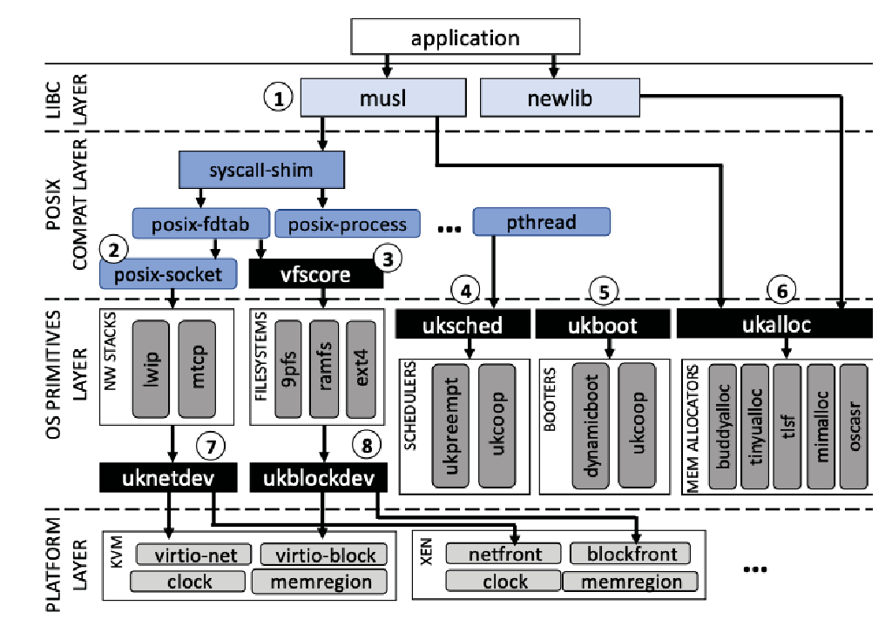

# 关于unikernel的理解
对于unikernel的理解，可以从操作系统的发展历程进行切入。
早期的计算机主要用于处理一些特定的计算任务，这时候的操作系统要做的也仅是将多个作业打包成一个批次，自动按照顺序执行。

随着计算机发展，计算机的性能也在不断提升，人们希望能够在一台计算机上执行多个任务。所以就提出了功能更加丰富的操作系统，让操作系统作为计算机的管理员，对多个任务进行统筹调度。这里所说的管理员便是操作系统中的kernel。

后面又诞生出了虚拟化的概念，虚拟化技术令一台物理计算机可以同时运行多个虚拟机，每个虚拟机可以独立地运行不同的操作系统和应用程序，这大大节省了硬件资源。这种虚拟化技术在云服务行业应用非常广泛，强大的服务器上可以运行多个操作系统，继而提供给用户租赁以进行服务。

但这样提供的云服务器通常会有较大的资源浪费，即许多用户通常只需要云服务器实现非常单一且简单的服务，而这种简单的服务却要依托庞大的操作系统上执行，从而导致运行效率低下且会造成资源浪费。

于是便提出了unikernel操作系统，unikernel针对需要运行的特定应用程序对操作系统进行优化，使操作系统仅包含应用程序执行过程中所需要的环境，再将优化好的操作系统内核和应用程序打包成一个不可修改的镜像。由于舍弃了不需要用到的部分，这使得unikernel的镜像大小可以达到非常小的量级，从而可以减少系统资源的占用、提高性能和安全性。

unikernel这种定制化的操作系统非常适用于云计算、容器化、物联网以及嵌入式等领域，较之原本的操作系统，也表现得更加快速、更加轻量级也更加安全，

# 关于unikraft的理解

但unikernel系统的定制过程中通常非常的复杂，目前也出现了比较多的unikernel的实现版本，而unikraft便是其中之一。unikraft实现了操作系统原语模块化，并提供了一套高性能可组合的API，这使得系统定制更加容易。

# unikraft结构

unikraft的设计核心思路是系统原语的完全模块化以及提供一套高性能可组合的API。
所以unikraft在结构上实现了分层构建，依据 Everything is a micro-library 的原则，在每一层实现了规范的API设计和服务。

上图中的结构图，从上到下可以分为Libc layer、Posix compat layer、OS primitives layer、Platform layer四层。基本遵循较低层给较高层服务的原则，使得库之间的调用关系非常清晰。图中的每一个黑色方块表示一个API，而其他部分则都是一个个micro-library（微库），并且处于同一个方框内的微库可以互相代替。

# session1 总结以及遇到的一些问题

## kraft构建

kraft构建是使用kraft init/config/build/run等命令来实现unikernel的初始化、配置、构建以及运行的过程。
命令实现起来比较简洁易懂。
这种配置方法主要依赖于kraft.yaml，该文件会给出unikernel的基本配置项，包括名字、版本、架构平台以及以来的库等信息。

## 手动构建

另一种比较常见的构建方法是使用Makefile文件手动进行构建。基本步骤可以总结为使用make menuconfig命令进行菜单式的配置设置、使用make命令进行构建、使用qemu-system进行虚拟化来运行生成的镜像文件。通常来说会比较习惯使用该方法。

这个方法主要依赖于Makefile、Makefile.uk、Config.uk等文件

## 得到定制化unikernel的基本流程

通过以上介绍以及session的四个任务之后，得到unikernel的基本流程可以总结如下。
1. 编写需要在unikernel上运行的程序
2. 将程序需要的库记录，并添加到kraft.yaml和Makefile等文件中。
3. 设置基本的配置项，包括需要添加的库、运行的架构和平台、需要的设备配置信息等
4. 构建生成得到unikernel
5. 尝试运行unikernel，判断是否可以正常实现功能