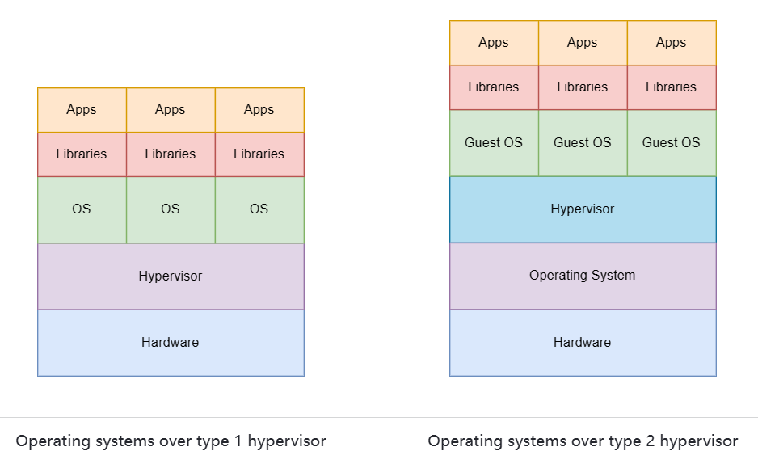
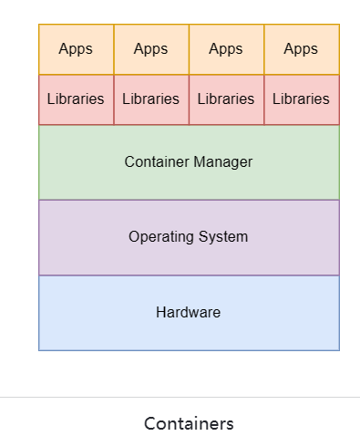
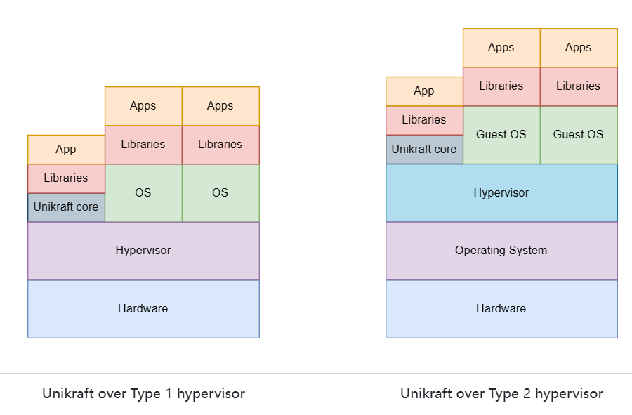

session2 详细介绍了虚拟化技术相关的内容以及unikraft的构建原理和过程

# 虚拟化技术

虚拟化技术，使得可以在一台机器上运行多个操作系统，并让每个操作系统都认为自己控制整个硬件。从而提高硬件的利用效率。实现虚拟化技术通常由两种环境，一种是虚拟机，一种是容器

## 虚拟机
虚拟机的运行依赖于管理程序。管理程序根据运行在裸机上还是运行在操作系统上又可以分为裸机管理程序和托管管理程序。如下图所示。

## 容器
容器是一种旨在仅包含和运行一个应用程序及其依赖项的环境。因此更加轻量级，也更加快速。容器的运行需要依赖于容器管理程序（如Docker）

## Unikraft
unikraft是介于虚拟机和容器两者之间的东西，unikraft包含操作系统，但仅最低限度的包含需要用到的部分。和虚拟机管理程序相同，可以分为裸机上运行的管理程序和操作系统上运行的管理程序。如下图所示。

# linuxu KVM
unikraft编译出得到的unikernel可以分为两种，一种是作为虚拟机，通过QEMU/KVM或者XEN来实现虚拟化，从而运行得到的系统镜像；另一种是作为linux程序，运行在用户空间中，这种通常只用于debug。

这里在QEMU/KVM上作为虚拟机运行，可以细分为模拟系统和半虚拟系统，前者通过程序模拟平台和架构，可以做到完全模拟想要的平台和架构；后者是通过操作系统提供的虚拟化接口KVM，虚拟机通过这些接口再来运行。

# Unikraft core
unikraft可以分为三个组成部分，分别是结构部分的代码，平台部分的代码，以及内部库的代码。第一个是用于对接不同的硬件结构，比如是X86还是arm，第二个是用于对接不同的平台，比如是KVM还是XEN，第三个则是提供了一些硬件之上的一般操作系统会提供的基本功能，用于给不同的应用提供服务。

# Libc in Unikraft
除了unikraft内核之外，为了给不同的应用程序提供服务，还需要提供unikraft之上的外部库，这些内部库类似于一般操作系统C标准库。

# Configuring Unikraft - Config.uk
Config.uk文件可以用于帮助得到unikraft构建过程所需要的配置文件。我们可以在menuconfig界面中进行设置。

# Build System
Makefile.uk文件也是构建unikernel过程中非常重要的一个文件，用于添加要编译的源文件。
最后通过Config.uk、程序源代码、Makefile、Makefile.uk文件即可手动构建得到最终的镜像文件。

# Running Unikraft
使用qemu-system-x86_64运行镜像文件的时候，需要提供镜像文件必要的参数，比如文件系统设备、网络设备、镜像文件地址等信息。

# 构建过程中可能出错的点
1. Makefile的libc是有依赖顺序的，顺序错误可能导致构建错误。
2. 总是构建错误时，可以尝试使用make distclean/properclean清除build文件夹或.config文件
3. menuconfig界面设置文件系统的根目录参数时，需要与运行镜像文件时一致。
